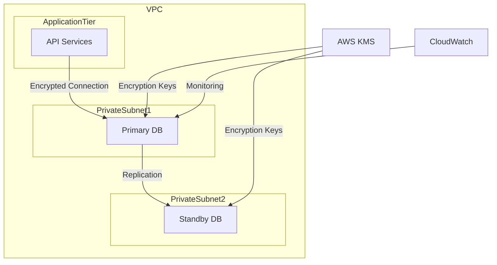
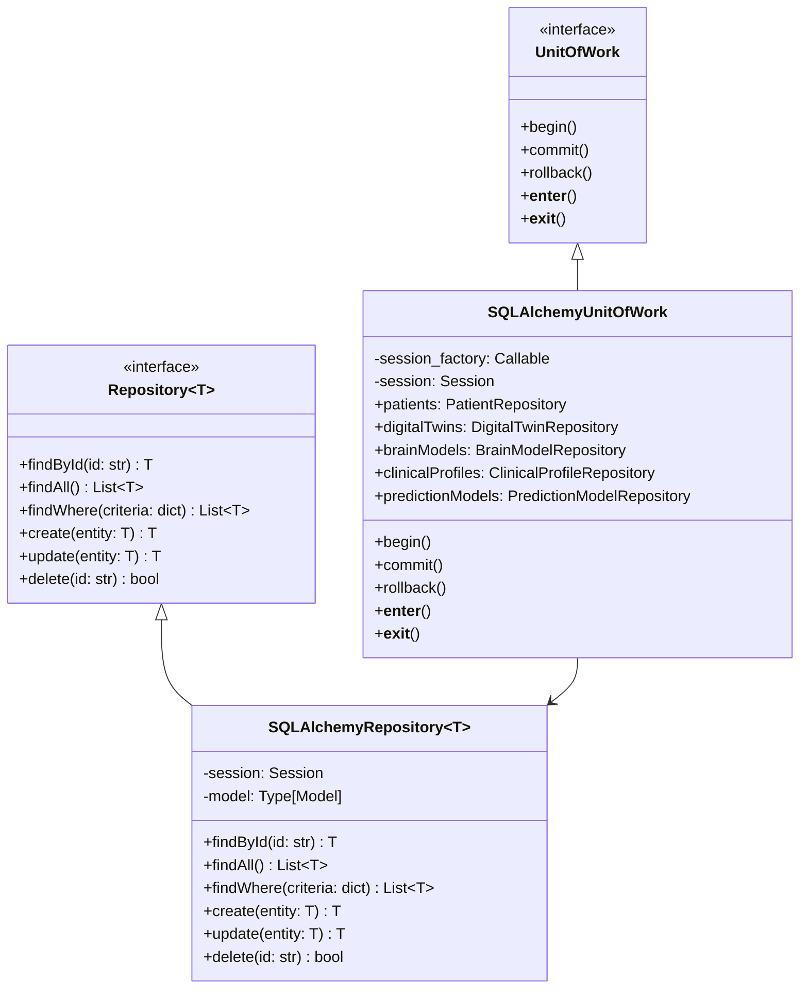
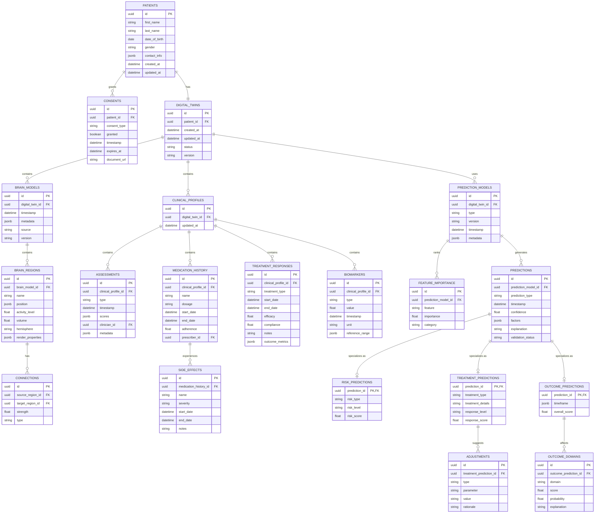

# Persistent Storage Architecture

## Overview

This document outlines the persistent storage architecture for the HIPAA-compliant Concierge Psychiatry Platform's Digital Twin MVP. The storage layer is designed to provide secure, scalable, and compliant data persistence for all domain entities while maintaining strict separation between domain models and persistence infrastructure.

## Core Components

### 1. Database Architecture

The persistent storage solution uses AWS RDS for PostgreSQL with the following characteristics:

- HIPAA-compliant encryption at rest (AWS KMS)
- Network isolation via VPC and security groups
- Multi-AZ deployment for high availability
- Automated backups with point-in-time recovery
- Performance insights monitoring



### 2. Data Access Layer

The data access layer follows the Repository pattern to provide an abstraction between domain entities and database operations:



### 3. Database Schema

The schema respects the domain model while optimizing for query performance and data integrity:



### 4. ORM Mapping

SQLAlchemy ORM models are separated from domain entities to maintain a clean domain layer:

```python
# Example SQLAlchemy model
from sqlalchemy import Column, String, Float, DateTime, Boolean, ForeignKey, JSON
from sqlalchemy.dialects.postgresql import UUID
from sqlalchemy.ext.declarative import declarative_base
from sqlalchemy.orm import relationship
import uuid
from datetime import datetime

Base = declarative_base()

class PatientModel(Base):
    __tablename__ = "patients"
    
    id = Column(UUID(as_uuid=True), primary_key=True, default=uuid.uuid4)
    first_name = Column(String, nullable=False)
    last_name = Column(String, nullable=False)
    date_of_birth = Column(DateTime, nullable=False)
    gender = Column(String, nullable=False)
    contact_info = Column(JSON, nullable=False)
    created_at = Column(DateTime, default=datetime.utcnow)
    updated_at = Column(DateTime, default=datetime.utcnow, onupdate=datetime.utcnow)
    
    # Relationships
    consents = relationship("ConsentModel", back_populates="patient")
    digital_twin = relationship("DigitalTwinModel", back_populates="patient", uselist=False)
```

### 5. Data Mapper

Mappers handle the conversion between domain entities and ORM models:

```python
# Example mapper
from app.domain.entities.patient import Patient, ContactInfo
from app.infrastructure.persistence.models.patient import PatientModel

class PatientMapper:
    @staticmethod
    def to_entity(model: PatientModel) -> Patient:
        """Convert ORM model to domain entity."""
        return Patient(
            id=str(model.id),
            first_name=model.first_name,
            last_name=model.last_name,
            date_of_birth=model.date_of_birth,
            gender=model.gender,
            contact_info=ContactInfo(**model.contact_info),
            created_at=model.created_at,
            updated_at=model.updated_at
        )
    
    @staticmethod
    def to_model(entity: Patient) -> PatientModel:
        """Convert domain entity to ORM model."""
        return PatientModel(
            id=uuid.UUID(entity.id) if entity.id else uuid.uuid4(),
            first_name=entity.first_name,
            last_name=entity.last_name,
            date_of_birth=entity.date_of_birth,
            gender=entity.gender,
            contact_info=entity.contact_info.dict(),
            created_at=entity.created_at,
            updated_at=entity.updated_at
        )
```

## HIPAA Compliance Measures

### 1. Encryption

- **Encryption at Rest**: All database volumes are encrypted using AWS KMS with customer-managed keys
- **Encryption in Transit**: All connections to the database use TLS 1.2 or higher
- **Column-Level Encryption**: Sensitive PHI fields use additional application-level encryption

### 2. Access Controls

- **IAM Integration**: Database access is controlled via IAM roles and policies
- **Least Privilege**: Database users have minimal permissions required for their function
- **Connection Proxying**: All database connections are proxied and logged

### 3. Audit Trail

- **Row-Level History**: Every database row maintains creation, modification, and deletion audit information
- **Versioning**: Critical tables implement full history tracking with temporal tables
- **Change Logging**: All data modifications are logged to a secure audit log

### 4. Data Retention

- **Configurable Retention**: Data retention periods are configurable per entity type
- **Soft Deletion**: Entities are soft-deleted by default for recovery purposes
- **Hard Deletion**: Scheduled processes permanently remove data past retention periods

## Implementation Details

### 1. Setup Script

```python
from sqlalchemy import create_engine
from sqlalchemy.orm import sessionmaker
from app.infrastructure.persistence.models.base import Base

def setup_database(connection_string):
    """Initialize database and create tables."""
    engine = create_engine(
        connection_string,
        echo=False,
        pool_pre_ping=True,
        pool_size=10,
        max_overflow=20
    )
    Base.metadata.create_all(engine)
    return sessionmaker(bind=engine)
```

### 2. Repository Implementation

```python
from typing import List, Dict, Any, Type, Optional, Generic, TypeVar
from sqlalchemy.orm import Session
from app.domain.repositories.repository import Repository
from app.infrastructure.persistence.mappers.base import Mapper

T = TypeVar('T')
M = TypeVar('M')

class SQLAlchemyRepository(Generic[T, M], Repository[T]):
    """SQLAlchemy implementation of the repository pattern."""
    
    def __init__(self, session: Session, model_class: Type[M], mapper: Mapper[T, M]):
        self.session = session
        self.model_class = model_class
        self.mapper = mapper
    
    def find_by_id(self, id: str) -> Optional[T]:
        """Find an entity by its ID."""
        model = self.session.query(self.model_class).filter_by(id=id).first()
        return self.mapper.to_entity(model) if model else None
    
    def find_all(self) -> List[T]:
        """Find all entities."""
        models = self.session.query(self.model_class).all()
        return [self.mapper.to_entity(model) for model in models]
    
    def find_where(self, criteria: Dict[str, Any]) -> List[T]:
        """Find entities matching criteria."""
        query = self.session.query(self.model_class)
        for key, value in criteria.items():
            query = query.filter(getattr(self.model_class, key) == value)
        models = query.all()
        return [self.mapper.to_entity(model) for model in models]
    
    def create(self, entity: T) -> T:
        """Create a new entity."""
        model = self.mapper.to_model(entity)
        self.session.add(model)
        self.session.flush()
        return self.mapper.to_entity(model)
    
    def update(self, entity: T) -> T:
        """Update an existing entity."""
        model = self.mapper.to_model(entity)
        self.session.merge(model)
        self.session.flush()
        return entity
    
    def delete(self, id: str) -> bool:
        """Delete an entity by ID."""
        model = self.session.query(self.model_class).filter_by(id=id).first()
        if model:
            self.session.delete(model)
            self.session.flush()
            return True
        return False
```

### 3. Unit of Work Implementation

```python
from sqlalchemy.orm import Session, sessionmaker
from contextlib import AbstractContextManager
from typing import Callable
from app.domain.repositories.unit_of_work import UnitOfWork
from app.infrastructure.persistence.repositories.patient_repository import SQLAlchemyPatientRepository
from app.infrastructure.persistence.repositories.digital_twin_repository import SQLAlchemyDigitalTwinRepository
from app.infrastructure.persistence.mappers.patient_mapper import PatientMapper
from app.infrastructure.persistence.mappers.digital_twin_mapper import DigitalTwinMapper
from app.infrastructure.persistence.models.patient import PatientModel
from app.infrastructure.persistence.models.digital_twin import DigitalTwinModel

class SQLAlchemyUnitOfWork(UnitOfWork, AbstractContextManager):
    """SQLAlchemy implementation of the Unit of Work pattern."""
    
    def __init__(self, session_factory: Callable[[], Session]):
        self.session_factory = session_factory
        self.session = None
    
    def __enter__(self):
        self.session = self.session_factory()
        
        # Initialize repositories
        self.patients = SQLAlchemyPatientRepository(
            self.session, 
            PatientModel, 
            PatientMapper()
        )
        
        self.digital_twins = SQLAlchemyDigitalTwinRepository(
            self.session, 
            DigitalTwinModel, 
            DigitalTwinMapper()
        )
        
        # Initialize other repositories
        
        return self
    
    def __exit__(self, exc_type, exc_val, exc_tb):
        if exc_type:
            self.rollback()
        else:
            self.commit()
        self.session.close()
    
    def commit(self):
        self.session.commit()
    
    def rollback(self):
        self.session.rollback()
```

### 4. Dependency Injection Setup

```python
from fastapi import Depends
from sqlalchemy.orm import Session
from app.infrastructure.persistence.session import get_session
from app.infrastructure.persistence.repositories.patient_repository import SQLAlchemyPatientRepository
from app.infrastructure.persistence.repositories.digital_twin_repository import SQLAlchemyDigitalTwinRepository
from app.infrastructure.persistence.unit_of_work import SQLAlchemyUnitOfWork
from app.domain.repositories.unit_of_work import UnitOfWork

def get_unit_of_work(session: Session = Depends(get_session)) -> UnitOfWork:
    """Dependency injection for UnitOfWork."""
    return SQLAlchemyUnitOfWork(lambda: session)

def get_patient_repository(session: Session = Depends(get_session)) -> SQLAlchemyPatientRepository:
    """Dependency injection for PatientRepository."""
    return SQLAlchemyPatientRepository(
        session, 
        PatientModel, 
        PatientMapper()
    )

def get_digital_twin_repository(session: Session = Depends(get_session)) -> SQLAlchemyDigitalTwinRepository:
    """Dependency injection for DigitalTwinRepository."""
    return SQLAlchemyDigitalTwinRepository(
        session, 
        DigitalTwinModel, 
        DigitalTwinMapper()
    )
```

## Database Migration Strategy

Database schema migrations are managed using Alembic:

1. **Versioned Migrations**: Each schema change is captured in a versioned migration script
2. **Automated Generation**: Migration scripts can be auto-generated based on model changes
3. **Safe Upgrades/Downgrades**: Each migration includes both upgrade and downgrade paths
4. **Integration with CI/CD**: Migrations are automatically applied during deployment

```python
# Example Alembic migration
"""Create patients table

Revision ID: 1a2b3c4d5e6f
Revises: 
Create Date: 2025-03-29 12:00:00

"""
from alembic import op
import sqlalchemy as sa
from sqlalchemy.dialects.postgresql import UUID, JSONB
import uuid

# revision identifiers
revision = '1a2b3c4d5e6f'
down_revision = None
branch_labels = None
depends_on = None

def upgrade():
    op.create_table(
        'patients',
        sa.Column('id', UUID(as_uuid=True), primary_key=True, default=uuid.uuid4),
        sa.Column('first_name', sa.String(), nullable=False),
        sa.Column('last_name', sa.String(), nullable=False),
        sa.Column('date_of_birth', sa.DateTime(), nullable=False),
        sa.Column('gender', sa.String(), nullable=False),
        sa.Column('contact_info', JSONB, nullable=False),
        sa.Column('created_at', sa.DateTime(), server_default=sa.func.now()),
        sa.Column('updated_at', sa.DateTime(), server_default=sa.func.now(), onupdate=sa.func.now())
    )

def downgrade():
    op.drop_table('patients')
```

## Performance Considerations

1. **Indexing Strategy**:
   - Primary key UUIDs use index-optimized storage
   - Foreign keys are automatically indexed
   - Additional indexes on frequently queried fields
   - Composite indexes for common query patterns

2. **Query Optimization**:
   - Eager loading relationships to avoid N+1 query problems
   - Projection queries to retrieve only needed fields
   - Pagination for large result sets
   - Query statistics and execution plan monitoring

3. **Connection Pooling**:
   - Configurable connection pool size
   - Connection lifecycle management
   - Connection keepalive and validation

## Implementation Steps

1. **Database Setup**
   - Create AWS RDS PostgreSQL instance with proper security settings
   - Configure network security, encryption, and IAM policies
   - Set up monitoring and alerting for database health

2. **ORM Layer Implementation**
   - Create SQLAlchemy models for all domain entities
   - Implement mappers between domain entities and ORM models
   - Create repository implementations for each entity type
   - Implement Unit of Work pattern for transaction management

3. **Migration Setup**
   - Initialize Alembic for migration management
   - Create baseline migration for initial schema
   - Set up CI/CD integration for automated migrations

4. **Testing**
   - Unit tests for mappers and repositories
   - Integration tests for complete data access flow
   - Performance tests for critical queries
   - Security tests for access controls and encryption

5. **Integration with Application Layer**
   - Configure dependency injection for repositories
   - Integrate with FastAPI endpoints
   - Add error handling for database operations
   - Implement connection pooling and retry logic

## HIPAA Compliance Testing

- **Encryption Verification**: Validate that all PHI data is encrypted at rest and in transit
- **Access Control Testing**: Verify that unauthorized users cannot access protected data
- **Audit Trail Validation**: Ensure all data operations are properly logged
- **Data Retention Testing**: Verify data retention policies are enforced
- **Data Sanitization**: Confirm that logs and error messages do not contain PHI