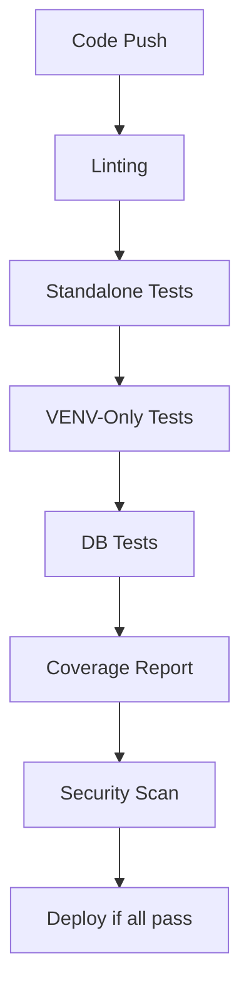

# Novamind Digital Twin Backend: Test Infrastructure (SSOT)

This document serves as the Single Source of Truth (SSOT) for the testing infrastructure of the Novamind Digital Twin Backend. It defines the test organization, execution, and tooling following Clean Architecture principles with a focus on efficiency and HIPAA compliance.

## 1. Dependency-Based Test Organization

The Novamind testing infrastructure organizes tests into three distinct dependency levels:

### Dependency Levels

| Level | Description | Directory | Characteristics |
|-------|-------------|-----------|-----------------|
| **Standalone** | No dependencies beyond Python itself | `/app/tests/standalone/` | Fastest to run, ideal for CI/CD early feedback |
| **VENV-Only** | Require Python packages but no external services | `/app/tests/venv_only/` | Medium execution speed |
| **DB-Required** | Require database connections or external services | Various directories | Most comprehensive but slowest to run |

This approach allows for optimized test execution where faster tests run first, providing early feedback on failures before launching more complex tests.

### Directory Structure

```
/backend/app/tests/              # Unified root for all tests
  __init__.py
  conftest.py                    # Global/shared fixtures
  /standalone/                   # Dependency-free tests
  /venv_only/                    # Tests needing only Python packages
  /unit/                         # Unit tests (isolated components)
    /domain/                     # Mirrors /app/domain
    /application/                # Mirrors /app/application
    /core/                       # Mirrors /app/core
    /infrastructure/             # Mirrors /app/infrastructure
  /integration/                  # Integration tests (components working together)
    /api/                        # API endpoint tests
    /application/                # Service/Use Case integration tests
    /infrastructure/             # Infrastructure integration tests
  /security/                     # Dedicated Security & HIPAA Compliance Tests
  /e2e/                          # End-to-end tests
  /fixtures/                     # Shared Pytest fixtures
```

## 2. Test Execution and CI/CD

### Test Execution Flow

For maximum efficiency, tests should be run in the following order:

1. **Standalone Tests**: No dependencies, fastest to run
2. **VENV-Only Tests**: Require Python packages but no external services
3. **DB-Required Tests**: Require full environment setup

### CI/CD Pipeline Integration



This staged approach ensures:
- Quick feedback for simple issues (within minutes)
- Detailed tests only run if basic tests pass
- Maximum efficiency in the CI/CD pipeline

## 3. Key Testing Tools

### Test Runners

| Script | Purpose | Usage |
|--------|---------|-------|
| `run_tests.sh` | Main test runner | `./scripts/run_tests.sh [all|standalone|venv|db]` |
| `run_dependency_tests.py` | Python implementation for dependency-based testing | `python scripts/run_dependency_tests.py [category]` |

### Test Maintenance Tools

| Script | Purpose | Usage |
|--------|---------|-------|
| `classify_tests.py` | Classify tests by dependency | `python scripts/classify_tests.py --update` |
| `identify_standalone_candidates.py` | Find standalone candidates | `python scripts/identify_standalone_candidates.py` |
| `debug_test_failures.py` | Debug test failures | `python scripts/debug_test_failures.py [category]` |

## 4. Test Implementation Guidelines

### 4.1 Naming Conventions

- **Files**: `test_[module_or_feature].py`
- **Functions/Methods**: `test_[behavior]_[conditions]_[expected_outcome]`
- **Classes**: `Test[Feature]` or `[Feature]Test`

### 4.2 Test Structure

Follow the Arrange-Act-Assert pattern:

```python
def test_user_service_creates_user_with_valid_data_returns_user(self):
    # Arrange
    user_data = {"name": "Test User", "email": "test@example.com"}
    user_service = UserService(user_repository=MockUserRepository())
    
    # Act
    result = user_service.create_user(user_data)
    
    # Assert
    assert result.name == "Test User"
    assert result.email == "test@example.com"
    assert result.id is not None
```

### 4.3 Dependency Markers

Use pytest markers to indicate dependency level:

```python
@pytest.mark.standalone
def test_something_simple():
    # Test with no dependencies

@pytest.mark.venv_only
def test_something_with_packages():
    # Test requiring only Python packages

@pytest.mark.db_required
def test_something_with_database():
    # Test requiring database access
```

### 4.4 HIPAA Compliance Testing

- Use synthetic data that mimics PHI structure without containing actual PHI
- Test sanitization/redaction functionality thoroughly
- Test access controls and authorization at all layers
- Validate that PHI is never logged or exposed in error messages

## 5. Coverage Requirements

| Component Type | Minimum Coverage |
|----------------|------------------|
| Domain Layer | 95% |
| Application Services | 90% |
| Infrastructure | 85% |
| Security Components | 95% |
| PHI Handling | 100% |
| Overall | 85% |

## 6. Test Creation Process

### 6.1 Adding New Standalone Tests

1. Identify pure logical components that require no external dependencies
2. Create test file in `/app/tests/standalone/`
3. Add `@pytest.mark.standalone` marker to test functions
4. Run test to verify it passes with no dependencies

### 6.2 Converting Unit Tests to Standalone

1. Run `python scripts/identify_standalone_candidates.py`
2. Review candidates and select suitable options
3. Create copies in standalone directory with necessary mocks
4. Verify tests work in standalone environment

### 6.3 Database Test Setup

1. Use fixtures from `/app/tests/fixtures/` for database access
2. Ensure proper isolation with transactions
3. Mark with `@pytest.mark.db_required`
4. Consider using SQLite for faster tests where possible

## 7. Test Execution Examples

### 7.1 Run All Tests in Optimal Order

```bash
./scripts/run_tests.sh all
```

### 7.2 Run Only Standalone Tests

```bash
./scripts/run_tests.sh standalone
```

### 7.3 Run Only VENV Tests

```bash
./scripts/run_tests.sh venv
```

### 7.4 Run DB Tests

```bash
./scripts/run_tests.sh db
```

### 7.5 Generate Classification Report

```bash
python scripts/classify_tests.py --verbose
```

## 8. Common Issues and Solutions

| Issue | Solution |
|-------|----------|
| Import Errors | Check correct Python path is set (`export PYTHONPATH=$(pwd)`) |
| DB Connection Failures | Verify the test database is running (`docker-compose -f docker-compose.test.yml up -d`) |
| Permission Issues | Ensure scripts are executable (`chmod +x scripts/*.sh`) |
| Test Discovery Issues | Check that `__init__.py` exists in all test directories |
| Test Collection Errors | Run with `pytest --collect-only` to debug import issues |

## 9. Conclusion

This test infrastructure provides a robust, efficient approach to testing the Novamind Digital Twin Backend. By following this SSOT guide, teams can maintain consistency, improve test quality, and ensure continuous compliance with HIPAA requirements.