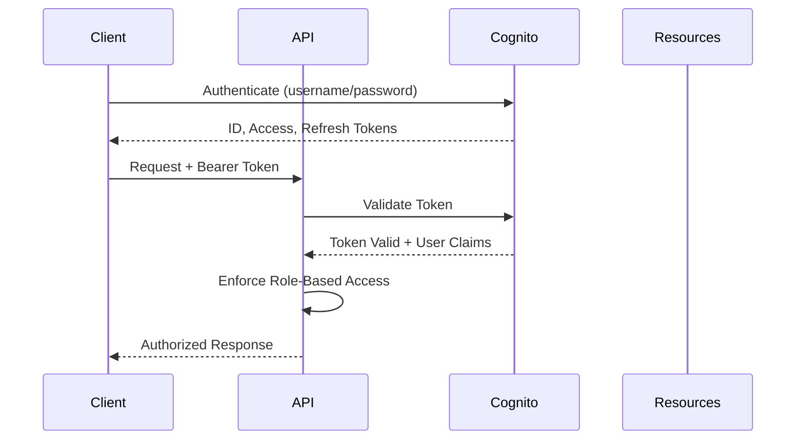

# Authentication & Authorization Architecture

## Overview

This document outlines the authentication and authorization architecture for the HIPAA-compliant Concierge Psychiatry Platform's Digital Twin MVP. The implementation follows AWS best practices for healthcare applications while maintaining strict HIPAA compliance.

## Core Components

### 1. AWS Cognito Integration

AWS Cognito will serve as the identity provider, offering enterprise-grade security with features essential for HIPAA compliance:

- Secure user directory with encryption at rest
- Multi-factor authentication (MFA) enforcement
- Comprehensive audit logging
- Integration with existing identity systems
- JWTs for stateless authentication

### 2. Authentication Flow



### 3. JWT Token Handling

JWT tokens will contain the following claims structure:

```json
{
  "sub": "12345678-1234-1234-1234-123456789012",
  "cognito:groups": ["psychiatrist", "admin"],
  "email_verified": true,
  "iss": "https://cognito-idp.{region}.amazonaws.com/{userPoolId}",
  "custom:clinic_id": "clinic_123",
  "custom:role": "psychiatrist",
  "exp": 1625097600,
  "iat": 1625094000
}
```

### 4. Role-Based Access Control (RBAC)

| Role         | Access Permissions                                         |
|--------------|------------------------------------------------------------|
| psychiatrist | Full access to patient records, digital twin, predictions  |
| admin        | Access to administrative functions and analytics           |
| patient      | Access to own records, limited digital twin visualization  |
| researcher   | De-identified data access, aggregate statistics            |

### 5. Multi-Factor Authentication (MFA)

MFA is mandatory for all administrative and clinician accounts as per HIPAA requirements:

- SMS verification (baseline)
- Authentication apps (preferred)
- Hardware security keys (highest security)

## Implementation Details

### FastAPI Integration

```python
from fastapi import Depends, HTTPException, status
from fastapi.security import OAuth2AuthorizationCodeBearer
import jwt
from app.core.config import settings

oauth2_scheme = OAuth2AuthorizationCodeBearer(
    authorizationUrl=f"{settings.COGNITO_DOMAIN}/oauth2/authorize",
    tokenUrl=f"{settings.COGNITO_DOMAIN}/oauth2/token"
)

async def get_current_user(token: str = Depends(oauth2_scheme)):
    """Validate JWT token and return user information."""
    try:
        # Decode and verify the JWT token
        payload = jwt.decode(
            token,
            options={"verify_signature": True},
            key=settings.COGNITO_PUBLIC_KEYS,
            algorithms=["RS256"],
            audience=settings.COGNITO_APP_CLIENT_ID
        )
        
        # Extract user information
        user_id = payload.get("sub")
        email = payload.get("email")
        groups = payload.get("cognito:groups", [])
        
        # Check if token is valid
        if user_id is None:
            raise HTTPException(
                status_code=status.HTTP_401_UNAUTHORIZED,
                detail="Invalid authentication credentials",
                headers={"WWW-Authenticate": "Bearer"},
            )
            
        # Return user information
        return {
            "id": user_id,
            "email": email,
            "roles": groups
        }
    except jwt.PyJWTError:
        raise HTTPException(
            status_code=status.HTTP_401_UNAUTHORIZED,
            detail="Invalid token or token expired",
            headers={"WWW-Authenticate": "Bearer"},
        )

def require_role(required_roles: list[str]):
    """Dependency for role-based access control."""
    async def _require_role(user = Depends(get_current_user)):
        user_roles = set(user.get("roles", []))
        if not any(role in user_roles for role in required_roles):
            raise HTTPException(
                status_code=status.HTTP_403_FORBIDDEN,
                detail=f"Insufficient permissions. Required roles: {required_roles}",
            )
        return user
    return _require_role
```

### Frontend Integration

```typescript
// src/infrastructure/auth/cognito.ts
import { Auth } from 'aws-amplify';

export async function configureAuth(): Promise<void> {
  Auth.configure({
    region: process.env.REACT_APP_AWS_REGION,
    userPoolId: process.env.REACT_APP_COGNITO_USER_POOL_ID,
    userPoolWebClientId: process.env.REACT_APP_COGNITO_CLIENT_ID,
    mandatorySignIn: true,
    authenticationFlowType: 'USER_SRP_AUTH',
    mfaConfiguration: 'OPTIONAL',
    mfaTypes: ['SMS', 'TOTP'],
  });
}

export async function signIn(username: string, password: string): Promise<any> {
  try {
    const user = await Auth.signIn(username, password);
    
    // Check if MFA is required
    if (user.challengeName === 'SMS_MFA' || user.challengeName === 'SOFTWARE_TOKEN_MFA') {
      return {
        requiresMFA: true,
        user
      };
    }
    
    return {
      requiresMFA: false,
      user
    };
  } catch (error) {
    console.error('Error signing in:', error);
    throw error;
  }
}

export async function completeMFAChallenge(user: any, code: string): Promise<any> {
  try {
    const loggedInUser = await Auth.confirmSignIn(
      user,
      code,
      user.challengeName === 'SMS_MFA' ? 'SMS_MFA' : 'SOFTWARE_TOKEN_MFA'
    );
    return loggedInUser;
  } catch (error) {
    console.error('Error completing MFA:', error);
    throw error;
  }
}

export async function signOut(): Promise<void> {
  try {
    await Auth.signOut();
  } catch (error) {
    console.error('Error signing out:', error);
    throw error;
  }
}

export async function getCurrentSession(): Promise<any> {
  try {
    return await Auth.currentSession();
  } catch (error) {
    console.error('Error getting current session:', error);
    throw error;
  }
}

export async function getIdToken(): Promise<string> {
  try {
    const session = await Auth.currentSession();
    return session.getIdToken().getJwtToken();
  } catch (error) {
    console.error('Error getting ID token:', error);
    throw error;
  }
}
```

## HIPAA Compliance Considerations

### 1. Audit Logging

All authentication events must be logged for HIPAA compliance:

- Failed login attempts
- Password changes
- MFA enrollment/unenrollment
- Role modifications
- Token revocations

### 2. Session Management

- Session timeout set to 15 minutes of inactivity
- Absolute session lifetime of 12 hours
- Concurrent session detection and prevention
- Secure token storage in frontend (httpOnly cookies)

### 3. Password Policies

- Minimum 12 characters
- Complexity requirements (uppercase, lowercase, numbers, special characters)
- Password history enforcement (prevent reuse of previous 24 passwords)
- 90-day maximum password lifetime

## Implementation Steps

1. Create AWS Cognito User Pool with appropriate HIPAA-compliant settings
2. Configure app client with proper OAuth scopes
3. Set up user groups for role-based access
4. Implement JWT validation middleware in FastAPI
5. Create frontend authentication service with AWS Amplify
6. Implement MFA enrollment and verification flows
7. Configure comprehensive authentication audit logging
8. Set up token refresh mechanism for extended sessions

## Testing and Validation

- Unit tests for JWT validation and role-based access control
- Integration tests for complete authentication flow
- Security testing including token tampering attempts
- Performance testing for authentication latency