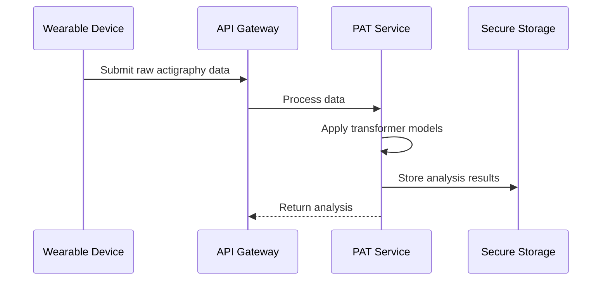
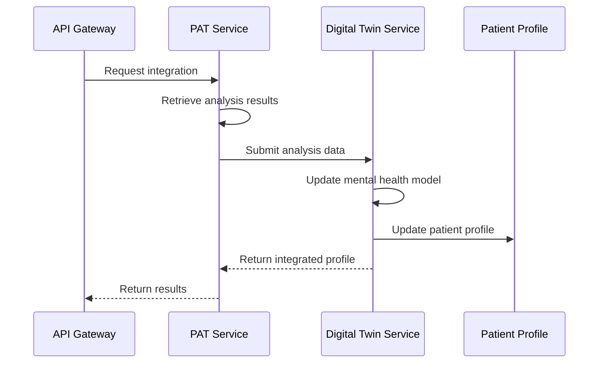

# PAT and Digital Twin Integration

## Overview

This document describes the technical implementation details for integrating the Pretrained Actigraphy Transformer (PAT) with the NOVAMIND Digital Twin system. The integration enables objective actigraphy data to enhance the Digital Twin's mental health modeling capabilities, creating a more comprehensive virtual representation of the patient.

## Architecture

The integration follows a bidirectional data flow model:

```
┌───────────────┐                    ┌───────────────┐
│     PAT       │──── Data Flow ───▶│  Digital Twin │
│   Service     │                    │    Service    │
└───────────────┘                    └───────────────┘
       ▲                                     │
       │                                     │
       └────────────── Feedback ─────────────┘
```

### Components

1. **PAT Service**: Processes raw actigraphy data to extract meaningful patterns and metrics
2. **Digital Twin Service**: Maintains a comprehensive psychological profile of the patient
3. **Integration Layer**: Connects PAT insights with the Digital Twin model

## Data Flow

### 1. Data Collection and Analysis



### 2. Digital Twin Integration



## Integration Methods

### 1. Direct Integration API

The primary method for integration is through the `integrate_with_digital_twin` method in the PAT service:

```python
@router.post("/digital-twin/integrate", response_model=IntegrationResponse)
async def integrate_with_digital_twin(
    request: IntegrationRequest,
    pat_service: PATInterface = Depends(get_pat_service),
    token: str = Depends(oauth2_scheme)
) -> IntegrationResponse:
    """
    Integrate actigraphy analysis with a patient's digital twin.
    
    This endpoint combines PAT insights with the Digital Twin model to enhance
    the virtual representation of the patient's mental health state.
    """
    validate_token(token)
    
    result = pat_service.integrate_with_digital_twin(
        patient_id=request.patient_id,
        profile_id=request.profile_id,
        actigraphy_analysis=request.actigraphy_analysis
    )
    
    return IntegrationResponse(**result)
```

### 2. Event-Based Integration

For asynchronous workflows, the system also supports event-based integration using an Observer pattern:

```python
class AnalysisCompletedEvent:
    """Event fired when an analysis is completed."""
    
    def __init__(self, patient_id: str, analysis_id: str, analysis_result: Dict[str, Any]):
        self.patient_id = patient_id
        self.analysis_id = analysis_id
        self.analysis_result = analysis_result


class DigitalTwinIntegrationObserver:
    """Observer that integrates PAT analyses with Digital Twin."""
    
    def __init__(self, digital_twin_service: DigitalTwinInterface):
        self.digital_twin_service = digital_twin_service
    
    def handle_analysis_completed(self, event: AnalysisCompletedEvent) -> None:
        """Handle analysis completed event by updating the Digital Twin."""
        # Retrieve patient's profile ID
        profile_id = self.digital_twin_service.get_profile_id_by_patient_id(
            event.patient_id
        )
        
        if profile_id:
            # Integrate with Digital Twin
            self.digital_twin_service.update_profile_with_actigraphy(
                profile_id=profile_id,
                patient_id=event.patient_id,
                actigraphy_data=event.analysis_result
            )
```

## Data Transformation

The integration process requires transforming PAT analysis data into a format suitable for the Digital Twin model:

### PAT Analysis Output

```json
{
  "analysis_id": "a123e4567-e89b-12d3-a456-426614174000",
  "patient_id": "p987e6543-e21b-12d3-a456-426614174000",
  "timestamp": "2025-03-28T14:30:00Z",
  "sleep_metrics": {
    "sleep_efficiency": 0.85,
    "sleep_duration_hours": 7.5,
    "wake_after_sleep_onset_minutes": 15.2,
    "sleep_latency_minutes": 12.5,
    "rem_percentage": 0.22,
    "deep_sleep_percentage": 0.18
  },
  "activity_levels": {
    "sedentary": 0.65,
    "light": 0.25,
    "moderate": 0.08,
    "vigorous": 0.02
  },
  "circadian_metrics": {
    "regularity_index": 0.79,
    "phase_stability": 0.82,
    "social_jet_lag_hours": 1.3
  }
}
```

### Digital Twin Input Format

```json
{
  "actigraphy_data": {
    "timestamp": "2025-03-28T14:30:00Z",
    "source": "PAT",
    "source_id": "a123e4567-e89b-12d3-a456-426614174000",
    "sleep": {
      "efficiency": 0.85,
      "duration_hours": 7.5,
      "waketime_minutes": 15.2,
      "latency_minutes": 12.5,
      "rem_percentage": 0.22,
      "deep_percentage": 0.18
    },
    "activity": {
      "sedentary_percentage": 0.65,
      "light_percentage": 0.25,
      "moderate_percentage": 0.08,
      "vigorous_percentage": 0.02
    },
    "circadian": {
      "regularity": 0.79,
      "stability": 0.82,
      "social_jet_lag_hours": 1.3
    }
  }
}
```

## Integration Process

### 1. Transform PAT Data

```python
def transform_pat_data_for_digital_twin(analysis: Dict[str, Any]) -> Dict[str, Any]:
    """Transform PAT analysis data for Digital Twin integration."""
    return {
        "actigraphy_data": {
            "timestamp": analysis["timestamp"],
            "source": "PAT",
            "source_id": analysis["analysis_id"],
            "sleep": {
                "efficiency": analysis["sleep_metrics"]["sleep_efficiency"],
                "duration_hours": analysis["sleep_metrics"]["sleep_duration_hours"],
                "waketime_minutes": analysis["sleep_metrics"]["wake_after_sleep_onset_minutes"],
                "latency_minutes": analysis["sleep_metrics"]["sleep_latency_minutes"],
                "rem_percentage": analysis["sleep_metrics"]["rem_percentage"],
                "deep_percentage": analysis["sleep_metrics"]["deep_sleep_percentage"]
            },
            "activity": {
                "sedentary_percentage": analysis["activity_levels"]["sedentary"],
                "light_percentage": analysis["activity_levels"]["light"],
                "moderate_percentage": analysis["activity_levels"]["moderate"],
                "vigorous_percentage": analysis["activity_levels"]["vigorous"]
            },
            "circadian": {
                "regularity": analysis["circadian_metrics"]["regularity_index"],
                "stability": analysis["circadian_metrics"]["phase_stability"],
                "social_jet_lag_hours": analysis["circadian_metrics"]["social_jet_lag_hours"]
            }
        }
    }
```

### 2. Update Digital Twin

```python
def update_digital_twin_with_actigraphy(
    digital_twin_service: DigitalTwinInterface,
    profile_id: str,
    patient_id: str,
    actigraphy_data: Dict[str, Any]
) -> Dict[str, Any]:
    """Update the Digital Twin with actigraphy data."""
    # Transform data
    transformed_data = transform_pat_data_for_digital_twin(actigraphy_data)
    
    # Update profile
    return digital_twin_service.update_profile(
        profile_id=profile_id,
        patient_id=patient_id,
        updates=transformed_data
    )
```

## Clinical Insights Generation

The integration enables the Digital Twin to generate enhanced clinical insights using actigraphy data:

```python
def generate_clinical_insights(
    digital_twin_service: DigitalTwinInterface,
    profile_id: str,
    with_actigraphy: bool = True
) -> Dict[str, Any]:
    """Generate clinical insights from the Digital Twin."""
    return digital_twin_service.generate_insights(
        profile_id=profile_id,
        data_sources=["self_report", "assessments", "actigraphy"] if with_actigraphy else ["self_report", "assessments"]
    )
```

## Mental Health Indicators

The combined data enhances several mental health indicators:

| Indicator | Enhancement from Actigraphy |
|-----------|----------------------------|
| Depression | Sleep disruptions, reduced activity levels |
| Anxiety | Restlessness, sleep latency |
| Bipolar | Activity patterns, circadian disruptions |
| PTSD | Sleep fragmentation, nighttime disturbances |
| Substance Use | Activity patterns, sleep irregularity |

## Implementation Example

### Integration Controller

```python
class ActigraphyIntegrationController:
    """Controller for integrating actigraphy data with Digital Twin."""
    
    def __init__(
        self,
        pat_service: PATInterface,
        digital_twin_service: DigitalTwinInterface
    ):
        self.pat_service = pat_service
        self.digital_twin_service = digital_twin_service
    
    def process_and_integrate(
        self,
        patient_id: str,
        readings: List[Dict[str, Any]],
        analysis_types: List[str]
    ) -> Dict[str, Any]:
        """Process actigraphy data and integrate with Digital Twin."""
        # Step 1: Process actigraphy data
        analysis = self.pat_service.analyze_actigraphy(
            patient_id=patient_id,
            readings=readings,
            start_time=readings[0]["timestamp"],
            end_time=readings[-1]["timestamp"],
            sampling_rate_hz=10.0,
            device_info={"device_type": "fitbit", "model": "versa-3"},
            analysis_types=analysis_types
        )
        
        # Step 2: Get patient's Digital Twin profile
        profile_id = self.digital_twin_service.get_profile_id_by_patient_id(
            patient_id
        )
        
        if not profile_id:
            profile_id = self.digital_twin_service.create_profile(
                patient_id=patient_id
            )
        
        # Step 3: Integrate with Digital Twin
        integration_result = self.pat_service.integrate_with_digital_twin(
            patient_id=patient_id,
            profile_id=profile_id,
            actigraphy_analysis=analysis
        )
        
        return integration_result
```

## HIPAA Compliance Considerations

The integration maintains HIPAA compliance through several mechanisms:

1. **Data Minimization**: Only clinically relevant metrics are transferred between systems
2. **Secure Channels**: All data exchange occurs over encrypted channels
3. **Access Controls**: Integration requires appropriate authentication and authorization
4. **Audit Logging**: All integration operations are logged for compliance auditing
5. **Data Redaction**: PHI is redacted from any debug or error logging

## Testing the Integration

### Unit Testing

```python
def test_transform_pat_data():
    """Test transforming PAT data for Digital Twin integration."""
    # Arrange
    analysis = {
        "analysis_id": "test-id",
        "patient_id": "test-patient",
        "timestamp": "2025-03-28T14:30:00Z",
        "sleep_metrics": {
            "sleep_efficiency": 0.85,
            "sleep_duration_hours": 7.5,
            "wake_after_sleep_onset_minutes": 15.2,
            "sleep_latency_minutes": 12.5,
            "rem_percentage": 0.22,
            "deep_sleep_percentage": 0.18
        },
        "activity_levels": {
            "sedentary": 0.65,
            "light": 0.25,
            "moderate": 0.08,
            "vigorous": 0.02
        },
        "circadian_metrics": {
            "regularity_index": 0.79,
            "phase_stability": 0.82,
            "social_jet_lag_hours": 1.3
        }
    }
    
    # Act
    result = transform_pat_data_for_digital_twin(analysis)
    
    # Assert
    assert result["actigraphy_data"]["source"] == "PAT"
    assert result["actigraphy_data"]["source_id"] == "test-id"
    assert result["actigraphy_data"]["sleep"]["efficiency"] == 0.85
    assert result["actigraphy_data"]["activity"]["sedentary_percentage"] == 0.65
    assert result["actigraphy_data"]["circadian"]["regularity"] == 0.79
```

### Integration Testing

```python
def test_integration_flow():
    """Test the end-to-end integration flow."""
    # Arrange
    pat_service = MockPAT()
    digital_twin_service = MockDigitalTwin()
    controller = ActigraphyIntegrationController(
        pat_service=pat_service,
        digital_twin_service=digital_twin_service
    )
    
    patient_id = "test-patient"
    readings = create_sample_readings(20)
    
    # Act
    result = controller.process_and_integrate(
        patient_id=patient_id,
        readings=readings,
        analysis_types=["sleep_quality", "activity_levels", "circadian_rhythm"]
    )
    
    # Assert
    assert result["patient_id"] == patient_id
    assert "integrated_profile" in result
    assert "sleep_patterns" in result["integrated_profile"]
    assert "activity_patterns" in result["integrated_profile"]
    assert "mental_health_indicators" in result["integrated_profile"]
```

## Conclusion

The integration between the PAT service and the Digital Twin creates a powerful clinical tool that combines objective biometric data with subjective patient reports and clinical assessments. This holistic approach enables clinicians to gain deeper insights into patient mental health states and deliver more personalized treatment plans.

By leveraging the strengths of both systems, the integration enhances:

1. **Assessment Accuracy**: Objective data validates or challenges subjective reports
2. **Treatment Monitoring**: Enables continuous, passive monitoring of patient progress
3. **Early Intervention**: Detects subtle changes in behavior patterns that may indicate relapse
4. **Personalization**: Allows for tailored treatment plans based on individual activity patterns
5. **Engagement**: Provides patients with meaningful feedback about their health behaviors

This technical integration represents a significant advancement in digital psychiatry, moving beyond self-reported symptoms to incorporate objective behavioral data in a clinically meaningful way.