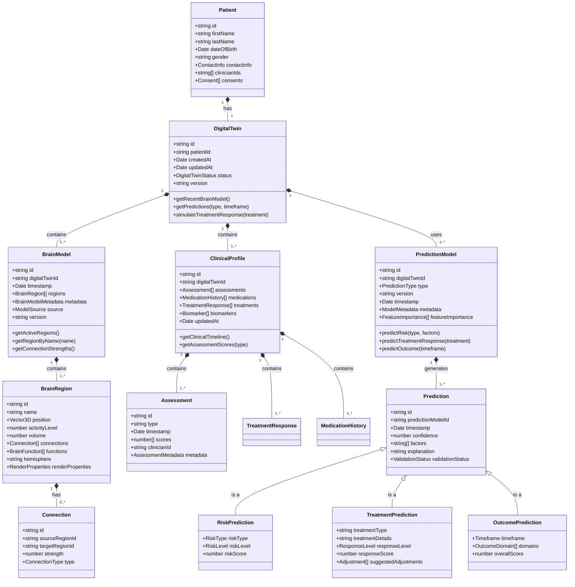

# Digital Twin Domain Models

## Overview

This document defines the core domain entities and value objects for the HIPAA-compliant Psychiatric Digital Twin MVP. These models represent the foundation of the Digital Twin system, maintaining strict separation of concerns and adhering to domain-driven design principles.

## Domain Model Architecture



## Core Domain Entities

### Patient

The root entity representing the individual receiving psychiatric care:

```typescript
export interface Patient {
  id: string;
  firstName: string;
  lastName: string;
  dateOfBirth: Date;
  gender: string;
  contactInfo: ContactInfo;
  clinicianIds: string[];
  consents: Consent[];
  createdAt: Date;
  updatedAt: Date;
}

export interface ContactInfo {
  email: string;
  phone: string;
  address: Address;
  emergencyContact: EmergencyContact;
}

export interface Consent {
  type: ConsentType;
  granted: boolean;
  timestamp: Date;
  expiresAt?: Date;
  documentUrl?: string;
}

export enum ConsentType {
  TREATMENT = 'treatment',
  DATA_COLLECTION = 'data_collection',
  RESEARCH_PARTICIPATION = 'research_participation',
  THIRD_PARTY_SHARING = 'third_party_sharing',
  DIGITAL_TWIN_CREATION = 'digital_twin_creation'
}
```

### DigitalTwin

The central entity of the system, representing a computational model of the patient's psychiatric and neurological state:

```typescript
export interface DigitalTwin {
  id: string;
  patientId: string;
  createdAt: Date;
  updatedAt: Date;
  status: DigitalTwinStatus;
  version: string;
  brainModels: BrainModel[];
  clinicalProfiles: ClinicalProfile[];
  predictionModels: PredictionModel[];
}

export enum DigitalTwinStatus {
  INITIALIZING = 'initializing',
  ACTIVE = 'active',
  UPDATING = 'updating',
  DEPRECATED = 'deprecated',
  ARCHIVED = 'archived'
}
```

### BrainModel

Representation of the patient's brain structure and function:

```typescript
export interface BrainModel {
  id: string;
  digitalTwinId: string;
  timestamp: Date;
  regions: BrainRegion[];
  metadata: BrainModelMetadata;
  source: ModelSource;
  version: string;
}

export interface BrainRegion {
  id: string;
  name: string;
  position: Vector3D;
  activityLevel: number; // 0.0 to 1.0
  volume: number;
  connections: Connection[];
  functions: BrainFunction[];
  hemisphere: 'left' | 'right' | 'bilateral';
  renderProperties: RenderProperties;
}

export interface Connection {
  id: string;
  sourceRegionId: string;
  targetRegionId: string;
  strength: number; // 0.0 to 1.0
  type: ConnectionType;
}

export interface Vector3D {
  x: number;
  y: number;
  z: number;
}

export interface RenderProperties {
  color: string;
  opacity: number;
  visible: boolean;
  highlightColor: string;
}

export enum ConnectionType {
  STRUCTURAL = 'structural',
  FUNCTIONAL = 'functional',
  EFFECTIVE = 'effective'
}

export enum BrainFunction {
  EMOTION_REGULATION = 'emotion_regulation',
  EXECUTIVE_FUNCTION = 'executive_function',
  MEMORY = 'memory',
  ATTENTION = 'attention',
  REWARD_PROCESSING = 'reward_processing',
  LANGUAGE = 'language',
  MOTOR = 'motor',
  SENSORY = 'sensory'
}

export enum ModelSource {
  NEUROIMAGING = 'neuroimaging',
  SIMULATION = 'simulation',
  POPULATION_AVERAGE = 'population_average',
  MACHINE_LEARNING = 'machine_learning'
}

export enum RenderMode {
  NORMAL = 'normal',
  ACTIVITY = 'activity',
  CONNECTIVITY = 'connectivity',
  ANOMALY = 'anomaly',
  TREATMENT_RESPONSE = 'treatment_response'
}
```

### ClinicalProfile

Clinical data representation for the patient:

```typescript
export interface ClinicalProfile {
  id: string;
  digitalTwinId: string;
  assessments: Assessment[];
  medications: MedicationHistory[];
  treatments: TreatmentResponse[];
  biomarkers: Biomarker[];
  updatedAt: Date;
}

export interface Assessment {
  id: string;
  type: AssessmentType;
  timestamp: Date;
  scores: Record<string, number>;
  clinicianId: string;
  metadata: AssessmentMetadata;
}

export interface MedicationHistory {
  id: string;
  name: string;
  dosage: string;
  startDate: Date;
  endDate?: Date;
  adherence?: number; // 0.0 to 1.0
  sideEffects?: SideEffect[];
  prescriberId: string;
}

export interface TreatmentResponse {
  id: string;
  treatmentType: TreatmentType;
  startDate: Date;
  endDate?: Date;
  efficacy: number; // 0.0 to 1.0
  compliance: number; // 0.0 to 1.0
  notes: string;
  outcomeMetrics: Record<string, number>;
}

export interface Biomarker {
  id: string;
  type: BiomarkerType;
  value: number;
  timestamp: Date;
  unit: string;
  referenceRange?: { min: number; max: number };
}

export enum AssessmentType {
  PHQ9 = 'phq9',
  GAD7 = 'gad7',
  MADRS = 'madrs',
  HAMD = 'hamd',
  YMRS = 'ymrs',
  PANSS = 'panss',
  QIDS = 'qids',
  ACES = 'aces'
}

export enum TreatmentType {
  MEDICATION_SSRI = 'medication_ssri',
  MEDICATION_SNRI = 'medication_snri',
  MEDICATION_ANTIPSYCHOTIC = 'medication_antipsychotic',
  MEDICATION_MOOD_STABILIZER = 'medication_mood_stabilizer',
  PSYCHOTHERAPY_CBT = 'psychotherapy_cbt',
  PSYCHOTHERAPY_DBT = 'psychotherapy_dbt',
  PSYCHOTHERAPY_PSYCHODYNAMIC = 'psychotherapy_psychodynamic',
  TMS = 'tms',
  ECT = 'ect',
  KETAMINE = 'ketamine'
}

export enum BiomarkerType {
  CORTISOL = 'cortisol',
  BDNF = 'bdnf',
  INFLAMMATORY_MARKERS = 'inflammatory_markers',
  HEART_RATE_VARIABILITY = 'heart_rate_variability',
  SLEEP_METRICS = 'sleep_metrics',
  GENETIC_MARKERS = 'genetic_markers'
}
```

### PredictionModel

Models for generating predictions based on the Digital Twin:

```typescript
export interface PredictionModel {
  id: string;
  digitalTwinId: string;
  type: PredictionType;
  version: string;
  timestamp: Date;
  metadata: ModelMetadata;
  featureImportance: FeatureImportance[];
  predictions: Prediction[];
}

export interface Prediction {
  id: string;
  predictionModelId: string;
  timestamp: Date;
  confidence: number; // 0.0 to 1.0
  factors: string[];
  explanation: string;
  validationStatus: ValidationStatus;
}

export interface RiskPrediction extends Prediction {
  riskType: RiskType;
  riskLevel: RiskLevel;
  riskScore: number; // 0.0 to 1.0
}

export interface TreatmentPrediction extends Prediction {
  treatmentType: string;
  treatmentDetails: string;
  responseLevel: ResponseLevel;
  responseScore: number; // 0.0 to 1.0
  suggestedAdjustments: Adjustment[];
}

export interface OutcomePrediction extends Prediction {
  timeframe: Timeframe;
  domains: OutcomeDomain[];
  overallScore: number; // 0.0 to 1.0
}

export interface FeatureImportance {
  feature: string;
  importance: number; // 0.0 to 1.0
  category: FeatureCategory;
}

export interface Adjustment {
  type: AdjustmentType;
  parameter: string;
  value: string;
  rationale: string;
}

export interface OutcomeDomain {
  domain: string;
  score: number; // 0.0 to 1.0
  probability: number; // 0.0 to 1.0
  explanation: string;
}

export enum PredictionType {
  RISK = 'risk',
  TREATMENT_RESPONSE = 'treatment_response',
  OUTCOME = 'outcome'
}

export enum RiskType {
  RELAPSE = 'relapse',
  SUICIDE = 'suicide',
  SELF_HARM = 'self_harm',
  HOSPITALIZATION = 'hospitalization',
  MEDICATION_DISCONTINUATION = 'medication_discontinuation'
}

export enum RiskLevel {
  LOW = 'low',
  MODERATE = 'moderate',
  HIGH = 'high',
  SEVERE = 'severe'
}

export enum ResponseLevel {
  POOR = 'poor',
  PARTIAL = 'partial',
  MODERATE = 'moderate',
  GOOD = 'good',
  EXCELLENT = 'excellent'
}

export enum ValidationStatus {
  PENDING = 'pending',
  VALIDATED = 'validated',
  REJECTED = 'rejected',
  UNCERTAIN = 'uncertain'
}

export enum FeatureCategory {
  CLINICAL = 'clinical',
  DEMOGRAPHIC = 'demographic',
  BIOLOGICAL = 'biological',
  TREATMENT = 'treatment',
  SOCIAL = 'social',
  ENVIRONMENTAL = 'environmental'
}

export enum AdjustmentType {
  DOSAGE = 'dosage',
  FREQUENCY = 'frequency',
  COMBINATION = 'combination',
  ALTERNATIVE = 'alternative',
  ADDITIONAL_THERAPY = 'additional_therapy'
}

export interface Timeframe {
  weeks?: number;
  months?: number;
  years?: number;
}
```

## Value Objects

Value objects are immutable and represent descriptive aspects of the domain:

```typescript
export interface BrainModelMetadata {
  resolution: string;
  acquisitionMethod?: string;
  processingPipeline?: string;
  confidenceLevel: number; // 0.0 to 1.0
  annotations?: Record<string, string>;
}

export interface AssessmentMetadata {
  completedBy: 'patient' | 'clinician' | 'caregiver';
  environment: 'clinic' | 'home' | 'hospital' | 'remote';
  reliability: number; // 0.0 to 1.0
  notes?: string;
}

export interface ModelMetadata {
  algorithm: string;
  trainingDataset: string;
  accuracy: number; // 0.0 to 1.0
  lastUpdated: Date;
  validationMethod: string;
  parameters: Record<string, any>;
}

export interface SideEffect {
  name: string;
  severity: 'mild' | 'moderate' | 'severe';
  startDate: Date;
  endDate?: Date;
  notes?: string;
}

export interface EmergencyContact {
  name: string;
  relationship: string;
  phone: string;
  email?: string;
}

export interface Address {
  street: string;
  city: string;
  state: string;
  postalCode: string;
  country: string;
}
```

## Domain Services

Domain services encapsulate operations that don't naturally belong to any single entity:

### DigitalTwinGenerator

```typescript
export interface DigitalTwinGenerator {
  generateInitialTwin(patient: Patient, clinicalData: ClinicalProfile): DigitalTwin;
  updateTwin(digitalTwin: DigitalTwin, newData: any): DigitalTwin;
  validateTwin(digitalTwin: DigitalTwin): ValidationResult;
}

export interface ValidationResult {
  valid: boolean;
  issues: ValidationIssue[];
}

export interface ValidationIssue {
  severity: 'warning' | 'error';
  message: string;
  entity: string;
  field?: string;
}
```

### TreatmentSimulator

```typescript
export interface TreatmentSimulator {
  simulateTreatmentResponse(
    digitalTwin: DigitalTwin,
    treatment: Treatment,
    timeframe: Timeframe
  ): SimulationResult;
  compareMultipleTreatments(
    digitalTwin: DigitalTwin,
    treatments: Treatment[],
    timeframe: Timeframe
  ): SimulationComparison;
}

export interface Treatment {
  type: TreatmentType;
  details: Record<string, any>;
  duration: Timeframe;
  schedule?: string;
}

export interface SimulationResult {
  predictedResponse: ResponseLevel;
  confidence: number;
  timeseriesData: TimePoint[];
  potentialSideEffects: PotentialSideEffect[];
  brainRegionChanges: RegionChange[];
}

export interface SimulationComparison {
  treatments: Treatment[];
  results: SimulationResult[];
  recommendation: {
    treatmentIndex: number;
    rationale: string;
  };
}

export interface TimePoint {
  timestamp: Date;
  metrics: Record<string, number>;
}

export interface PotentialSideEffect {
  name: string;
  probability: number;
  severity: 'mild' | 'moderate' | 'severe';
  timeframe: Timeframe;
}

export interface RegionChange {
  regionId: string;
  regionName: string;
  activityChange: number; // -1.0 to 1.0
  volumeChange: number; // -1.0 to 1.0
  connectivityChanges: ConnectivityChange[];
}

export interface ConnectivityChange {
  targetRegionId: string;
  targetRegionName: string;
  strengthChange: number; // -1.0 to 1.0
}
```

## Implementation Requirements

### Domain Layer Implementation

1. Create TypeScript interfaces and enums for all domain models in `frontend/src/domain/models/`
2. Create Python domain entities in `app/domain/entities/` with proper type hints
3. Ensure domain models have no dependencies on external frameworks or infrastructure

### Core Services Implementation

1. Implement domain services as abstract interfaces in the domain layer
2. Provide concrete implementations in the application layer
3. Use factories for creating complex domain objects

### Integration with XGBoost Service

1. Map prediction results from XGBoost to domain prediction models
2. Update digital twin with new prediction data
3. Use Observer pattern to notify when digital twin is updated

## HIPAA Compliance Considerations

1. Ensure all PHI is properly encrypted at rest and in transit
2. Implement fine-grained access control for each domain entity
3. Maintain detailed audit logs for all modifications to domain entities
4. Implement pseudonymization for research and analytics purposes
5. Maintain versioning of all domain entities for compliance and rollback capabilities